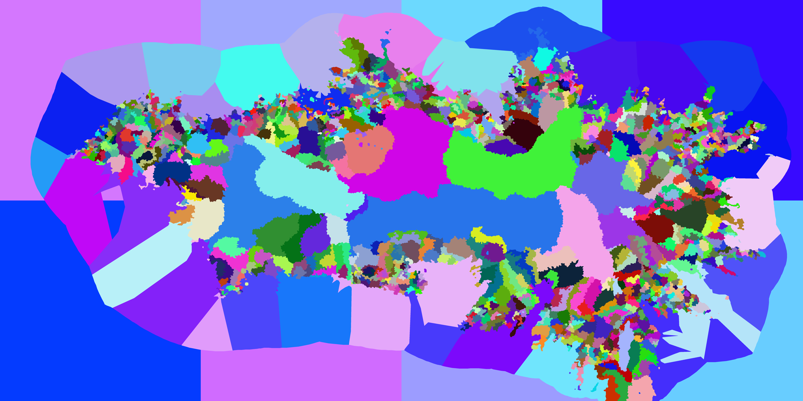

# AzgaarToCK3

**The Lemur Converter** turns your [Azgaar's Fantasy Map Generator](https://azgaar.github.io/Fantasy-Map-Generator/) world into a fully playable Crusader Kings III mod — no manual fine-tuning required to start playing.


---

## Why this converter

Use this converter if you hve a beloved Azgaar map you have spent time curating and care about. Or if you just want to be able to play in a brand new world that you heave never seen before. This converter tries to inject AS LITTLE new information into the output as posiible. Valueing clear rules and deterministic outputs. In this converter it is easy to understand how the game world will end up looking when working in the Azgaar tool.

**The title hierarchy maps directly from your Azgaar data:**
- Every burg becomes a barony — exact, 1:1. A 50k point map produces 1,000+ baronies.
- Every Azgaar province becomes a duchy.
- Most Azgaar states becomes a kingdom.

Where CK3 needs structure Azgaar doesn't have — counties and empires — the converter infers them algorithmically from population data. Predictable, not arbitrary.



Barony positions faithfully reflect where Azgaar places its burgs — coastal settlements land on the coast, inland cities land inland. The map below is an honest close-up of the current output: burg accuracy is there, terrain variety is a [known gap](ROADMAP.md) currently in development.


**Same input, same output.** Determinism is a core design goal. Pass `--seed <N>` and every run produces the same world. The title hierarchy is entirely rule-based; the only randomness is in culture and faith fields where Azgaar simply doesn't carry enough data to fill every CK3-specific slot — and even that is seeded.

**What gets generated:**

| | |
|---|---|
| **Cultures** | Full CK3 culture system following your Azgaar family tree — If two cultures are related they should look very simmilar, support culture hybridization. Uses 41 verified base-game traditions, custom defined GFX bundles and ethnicity distributions. |
| **Faiths** | Doctrines and tenets follow the Azgaar religion tree — child faiths inherit from their parent then mutate slot-by-slot simmilar to cultures. Holy sites with modifiers, broad localization support. |
| **Characters** | interesting and predicatbel mix of independent rulers of different ranks |
| **Rivers** | The first Azgaar converter to draw rivers — A\* pathfinding, correct tributary connections |


---

## Requirements
- Crusader Kings III `1.18.4` (newest at the time of writing)
- [Total Conversion Sandbox](https://steamcommunity.com/sharedfiles/filedetails/?id=2524797018) mod (Steam Workshop) (Working to make this dependency obsolete.)
- [Azgaar's Fantasy Map Generator](https://azgaar.github.io/Fantasy-Map-Generator/) — default settings work out of the box. An [alternate build](https://pryvyd9.github.io/Fantasy-Map-Generator/) produces better sea zones; if you use it, **do not use its built-in "Export for CK3" button** — that targets a different converter.

---

## Quick start

1. In Azgaar, export: **GeoJSON cells**, **JSON full data**, and optionally **Rivers** (GeoJSON)
2. Run the converter pointing at the folder containing those files:
   ```
   ./ConsoleUI -d "path/to/your/export/folder"
   ```
3. On first run you'll be prompted for your CK3 path, mods directory, and mod name — these are saved and not asked again
4. Enable the generated mod in your CK3 playset and launch

See the [Usage Guide](docs/USAGE.md) for CLI options, seed control, and debug output.

---

## What's missing

The converter is under active development. Province terrain, major rivers, and a handful of other features are incomplete or missing. See **[ROADMAP.md](ROADMAP.md)** for the full honest account.

---

## Links

| | |
|---|---|
| [Roadmap](ROADMAP.md) | Current state, known bugs, planned features |
| [Conversion Rules](docs/CONVERSION_RULES.md) | How Azgaar data maps to CK3; fine-tuning tips |
| [Usage Guide](docs/USAGE.md) | Detailed run instructions and options |
| [Configuration](docs/CONFIGURATION.md) | All settings and CLI flags |
| [Issues](https://github.com/MnTronslien/AzgaarToCK3/issues) | Bug reports and feature requests |
| [Discord](https://discord.gg/Px6dwFVdUG) | Community and support |
| [Contributing](CONTRIBUTING.md) | How to build, branch, and submit a PR |
| [On AI and Authorship](AI.md) | About the role of AI in this project |
