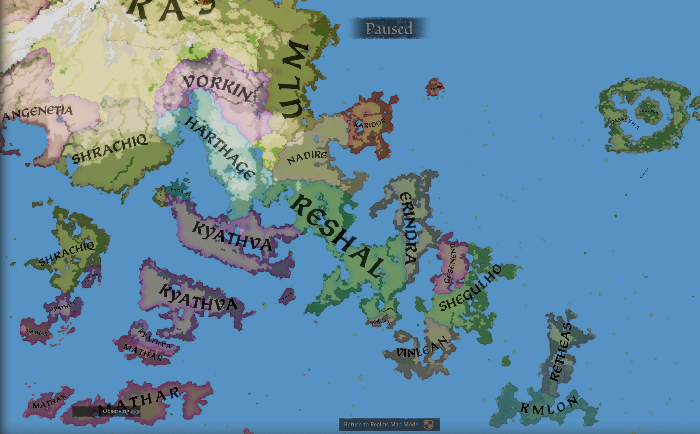

# AzgaarToCK3

**The Lemur Converter** turns your [Azgaar's Fantasy Map Generator](https://azgaar.github.io/Fantasy-Map-Generator/) world into a fully playable Crusader Kings III mod — no manual fine-tuning required to start playing.



---
**With this converter you will get**
- Full support for the original 5 title ranks

- Sensible de jure and de facto hierarchies, ripe for gameplay!
- Major rivers!
- Functional custom religions, including holy sites!
- Functional custom Cultures!
- Deterministic conversion
- No need to open the map editor

## Why this converter

Use this converter if:
- You care about an Azgaar map and want to see it in Crusader Kings 3. 
- You just want to play in a randomly generated world. 
- Want to go back and forth from map to game to tweak the output. The development philosophy behind the converter is to inject as little new information as possible, so that the output remains deterministic and predictable. Respecting the author of a map.

## Quick start

1. In Azgaar, export: **GeoJSON cells**, **JSON full data**, and optionally **Rivers** (GeoJSON)
2. Download the latest release for your preferred platform (TODO: link to release section)
2. Run the converter pointing at the folder containing those files:
   ```
   ./ConsoleUI -d "path/to/your/export/folder"
   ```
3. On first run you'll be prompted for your CK3 path, mods directory, and mod name — these are saved and not asked again
4. Enable the generated mod in your CK3 playset and launch

See the [Usage Guide](docs/USAGE.md) for CLI options, seed control, and debug output.
---

## Requirements
- Crusader Kings III `1.19.*` (newest at the time of writing, but any version should do)
- [Azgaar's Fantasy Map Generator](https://azgaar.github.io/Fantasy-Map-Generator/) — default settings work out of the box. An [alternate build](https://pryvyd9.github.io/Fantasy-Map-Generator/) produces better sea zones; if you use it, **do not use its built-in "Export for CK3" button** — that targets a different converter.

---

## What's missing

The converter is under active development. Province terrain and a handful of other features are incomplete or missing. See **[ROADMAP.md](ROADMAP.md)**.

---
### Join the Community!
[Discord](https://discord.com/invite/DeqTeDrzRQ)
---

## Links

| | |
|---|---|
| [Roadmap](ROADMAP.md) | Current state, known bugs, planned features |
| [Conversion Rules](docs/CONVERSION_RULES.md) | How Azgaar data maps to CK3; fine-tuning tips |
| [Usage Guide](docs/USAGE.md) | Detailed run instructions and options |
| [Configuration](docs/CONFIGURATION.md) | All settings and CLI flags |
| [Issues](https://github.com/MnTronslien/AzgaarToCK3/issues) | Bug reports and feature requests |
| [Discord](https://discord.gg/Px6dwFVdUG) | Community and support |
| [Contributing](CONTRIBUTING.md) | How to build, branch, and submit a PR |
| [On AI and Authorship](AI.md) | About the role of AI in this project |
