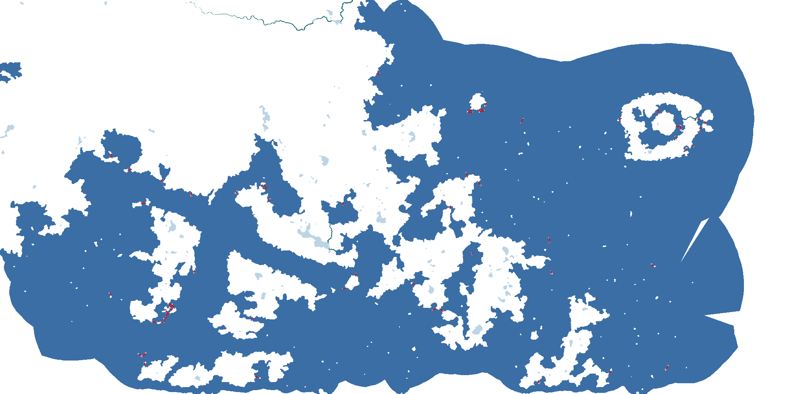

# Configuration Reference

Settings are stored in `settings.json` next to the `AzgaarToCK3` executable. CLI flags override `settings.json` for a single run. Delete `settings.json` to reset everything and be prompted again.

---

## Input paths

| Key | CLI | Type | Description |
|-----|-----|------|-------------|
| `InputDirectory` | `-d` | string | Directory to scan for input files (auto-detects latest) |
| `InputJsonPath` | `-j` | string | Explicit path to Azgaar full data `.json` |
| `InputGeojsonPath` | `-g` | string | Explicit path to Azgaar cells `.geojson` |
| `InputRiversGeojsonPath` | `-r` | string | Explicit path to Azgaar rivers `.geojson` |
Explicit paths (`-j`, `-g`, `-r`) always override directory auto-detection.

---

## Output

| Key | CLI | Type | Default | Description |
|-----|-----|------|---------|-------------|
| `ModsDirectory` | — | string | *(required)* | CK3 mods folder |
| `Ck3Directory` | — | string | *(required)* | CK3 install root |
| `ModName` | — | string | *(required)* | Name of the generated mod |
| `AutoWipeOutput` | `--no-wipe` | bool | `true` | Wipe mod folder before converting |

---

## Randomization

| Key | CLI | Type | Default | Description |
|-----|-----|------|---------|-------------|
| `Seed` | `--seed` | int? | `null` | Global seed; `null` = new seed each run |
| `TenetCount` | `--tenet-count` | int | `3` | Tenets per faith (1–5) |
| `DoctrineMutationRate` | `--doctrine-mutation-rate` | float | `0.3` | Child faith doctrine divergence (0 = identical, 1 = fully random) |

---

## Territory & hierarchy

| Key | CLI | Type | Default | Description |
|-----|-----|------|---------|-------------|
| `EmpireFromCulture` | `--empire-from-culture` | bool | `true` | Group kingdoms into empires by culture; `false` = by religion |
| `MinimumDuchiesPerKingdom` | `--min-duchies-per-kingdom` | int | `4` | Kingdoms with fewer duchies merge into a neighbour |
| `MinimumKingdomsPerEmpire` | `--min-kingdoms-per-empire` | int | `3` | Empires with fewer kingdoms merge into a neighbour |
| `HighPopulationThreshold` | — | int | `13000` | Duchy population above this → fewer, larger counties |
| `LowPopulationThreshold` | — | int | `2000` | Duchy population below this → more, smaller counties |
| `MinCounties` | — | int | `2` | Floor on counties per duchy |
| `MaxCounties` | — | int | `5` | Ceiling on counties per duchy |

---

## Rivers

| Key | CLI | Type | Default | Description |
|-----|-----|------|---------|-------------|
| `EnableRivers` | `--no-rivers` | bool | `true` | Draw rivers to the province map |
| `MajorRiverThreshold` | — | float | `999999` | Azgaar discharge value above which a river is treated as a major navigable river. Rivers at or above this threshold are carved into the cell map as river provinces. Set just below the discharge of the rivers you want navigable (e.g. `1000`). Default is effectively disabled — all rivers are drawn as minor. |
| `RiverProvinceCellCount` | — | int | `2` | Width of the carved river ribbon in cells. Higher values produce wider rivers and more cell carving. `2` is the recommended value for most maps. |

---

## Sea zones

| Key | Type | Default | Description |
|-----|------|---------|-------------|
| `SeaZoneTargetArea` | int | `25000` | Target area per sea zone (Azgaar cell-area units) |
| `SeaZoneMinimumArea` | int | `2500` | Minimum sea zone area |
| `FarSeaZoneCount` | int | `8` | Far-sea strips drawn behind the map edge |

---

## Straits

Sea crossings written to `map_data/adjacencies.csv`, joining baronies that sit across narrow water (and to nearby islands). Distances are in CK3 map pixels (the map is 8192 x 4096). Defaults are tuned; most maps need no change.

| Key | Type | Default | Description |
|-----|------|---------|-------------|
| `StraitMaxDistance` | float / null | `null` (auto) | Maximum crossing length, cell centre to cell centre, in map pixels. `null` auto-scales it by the map's cell count (about 120px on a ~4,000-cell map down to about 50px on a ~52,000-cell map), so sparse and dense maps both get sensible crossings. Set a number to pin it. |
| `StraitMinimumSelfSeparation` | float | `500` | A crossing between two coasts of the *same* landmass is skipped unless the overland walk between them is longer than this (summed cell-centre pixel distance). Stops a strait forming across a thin neck of land you could march around. Density-independent, so one value fits all maps. |
| `StraitMinimumClearance` | float | `400` | Minimum spacing, in map pixels, between two straits that join the same pair of landmasses. Keeps parallel crossings of one channel from bunching up. |
| `StraitOceanMinimumArea` | int | `2000` | Water bodies whose summed area (Azgaar cell-area units) is at or above this count as sea and can be crossed; smaller bodies are treated as lakes and left uncrossed. Lower it to also bridge to islands sitting inside smaller lakes. |

### Fine-tuning straits

Turn on `GenerateDebugImages` and the converter writes `10_straits.png` into
`%LOCALAPPDATA%\AzgaarToCK3\debug\<map>_<timestamp>\`. It shows what the knobs above produced:
white is land, blue is sea (crossable), pale blue is lake (left uncrossed), teal is major-river
cells, and each red line is a generated strait.



Re-running a full conversion for every knob tweak is slow on large maps. To iterate in about a
second, dump the cell grid once and re-render with the bundled `TerrainLab` tool:

```sh
# 1. dump the (post-river-insertion) cells once
AzgaarToCK3 -d "<your map folder>" --dump-cells cells.json

# 2. re-render straits at any knob values, repeat freely
TerrainLab --strait-map --cells cells.json --output straits.png \
  --strait-max-distance 50 --strait-self-sep 500 --strait-clearance 400 --strait-ocean-area 2000
```

Omit a flag to use its default (`--strait-max-distance` then auto-scales by cell count). When the
image looks right, copy the values you settled on into `settings.json`.

---

## Logging & debug

| Key | CLI | Type | Default | Description |
|-----|-----|------|---------|-------------|
| `LogLevel` | `--log-level` | enum | `Info` | `Verbose` / `Debug` / `Info` / `Warning` / `Error` |
| `GenerateDebugImages` | `--generate-debug-images <bool>` | bool | `true` | Save intermediate map images to `%LOCALAPPDATA%\AzgaarToCK3\debug\`. The flag overrides this setting in either direction. |

---

## Writer toggles

Individual writers can be disabled for faster bisection runs. All default to `true`.

```json
"Writers": {
  "DefinitionCsv": true,
  "DefaultMap": true,
  "LandedTitles": true,
  "Religion": true,
  "Faiths": true,
  "Cultures": true,
  "Characters": true,
  "TitleHistory": true,
  "ProvinceHistory": true,
  "Heightmap": true,
  "GeographicalRegions": true,
  "ProvinceTerrain": true,
  "Locators": true,
  "TerrainMasks": true,
  "Flatmap": true,
  "Adjacencies": true,
  "MapStaticFiles": true,
  "MapDefines": true
}
```
