# Conversion Rules

How your Azgaar data becomes a CK3 world — and where manual prep pays off.

The converter is designed to work well with the default settings in Azgaar — the philosophy being that you probably started tweaking and falling in love with a default map before you started to understand what the best settings are.

But for the very best results some handcrafting is recommended.

---

## Mapping table

| Azgaar | CK3 | Notes |
|--------|-----|-------|
| Burg | Barony (province) | Exact 1:1. Every burg becomes one barony. Cells within a province are distributed among the burgs using a BFS algorithm along the neighbour graph. If there are cells that it cannot reach through land-only neighbour traversal (such as if blocked by a major river or ocean) it will make a temporary connection and continue using the same BFS algorithm.|
| Province | Duchy | Exact 1:1. For very small states they can be generated without any Provinces in Azgaar. In those cases we backform a province from the state and use that as basis for the Duchy in CK3. Provinces without any burgs are skipped and rendered as wasteland.|
| State | Kingdom | Approximate. Small states are absorbed into larger kingdoms — see De Jure Consolidation below. But they remain de facto independents as a duchy on game start. |
| **County** | County | **Inferred** counties are constructed by grouping baronies together. The algorithm targets equal population per county and respects duchy boundaries. The balance tries to mimic base CK3 where in populous urbanized parts of the world there are fewer baronies per county (ref Byzantium), but in sparsely populated areas of the world (Russia, Nordics) there are more baronies per county. All this while maintaining a decent ratio between duchies and counties. The county capital is the most populous barony, unless a barony is marked as the province or state capital in Azgaar — that takes precedence. |
| **Empire** | Empire | **Inferred** — grouped by culture or faith, depending on the `EmpireFromCulture` setting. |
| Culture | Culture | Name and lineage from Azgaar. Heritage, language, ethos and martial custom are selected for root cultures and mutated down the lineage (and merge-mutated for hybrids). Traditions are chosen to fit the culture's land and ethos rather than at random — see [Culture traditions](#culture-traditions). Culture also selects a "theme bundle" — a converter concept for namelist, clothing, genes and architecture. |
| Religion | Faith + Religion group | Each root Azgaar religion becomes a religion group. Offshoot religions become faiths within their root religion's group. Doctrines are picked per faith; tenets are weighted by the faith's type, by mutual exclusivity, and by the religion's form — see [Faith tenets](#faith-tenets). Child faiths inherit their parent's tenets and mutate slot-by-slot. |
| Cell | — | Data basis for culture/religion distribution and province geometry. |


The same Azgaar map, before and after conversion:

| Azgaar | CK3 |
|--------|-----|
|**Political** 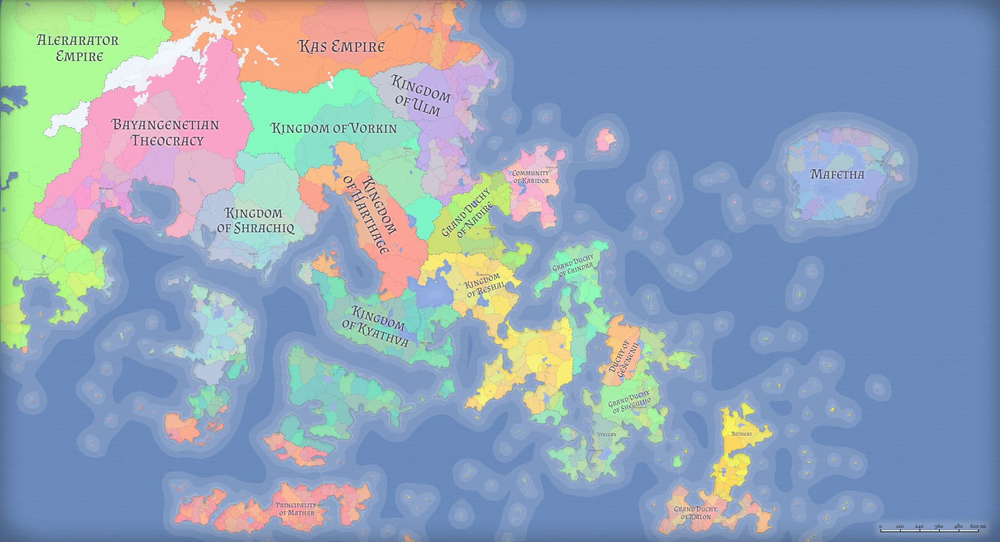 |  |
|**Cultural** 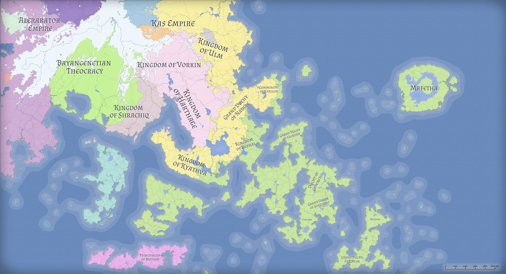 | 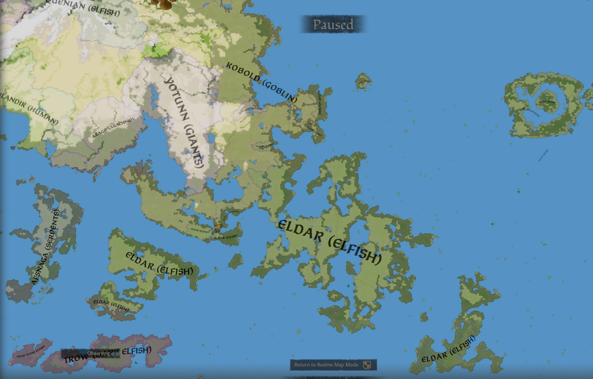 |
|**Religious** 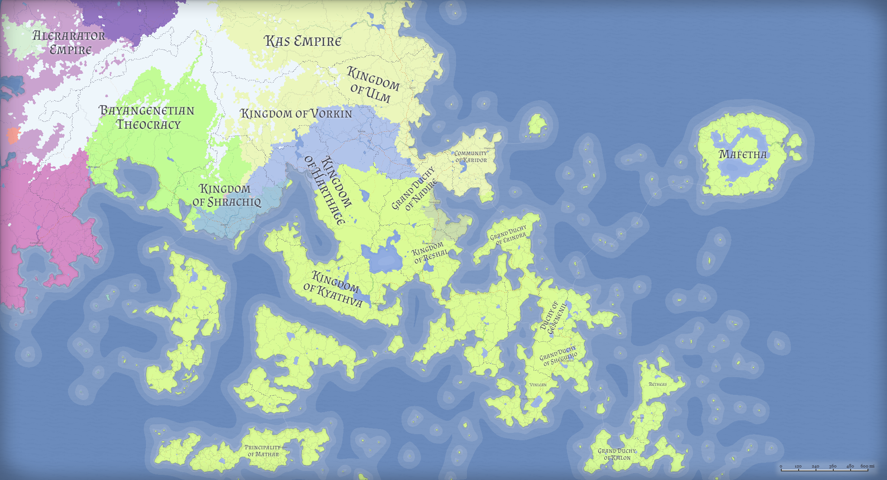 | 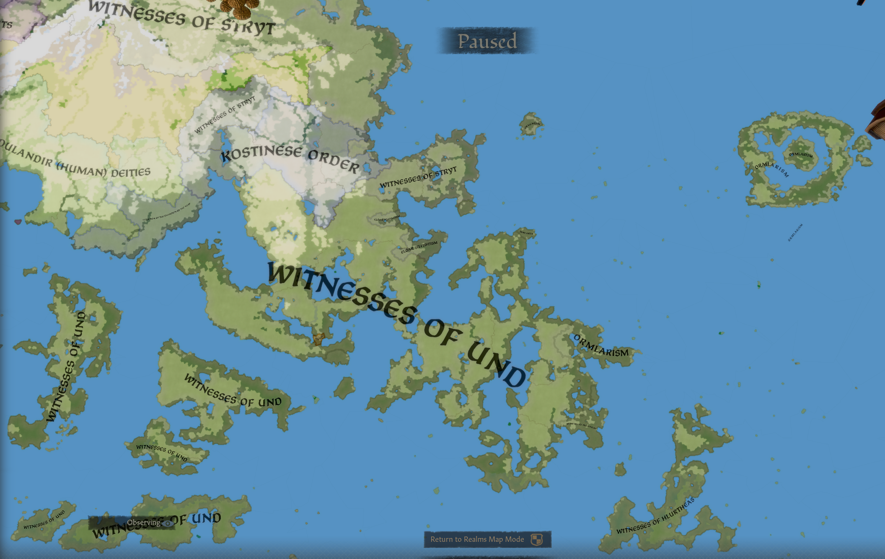 |

---

The images below show the same map at each tier — each colour is a distinct title:

| Counties | Duchies |
|----------|---------|
| 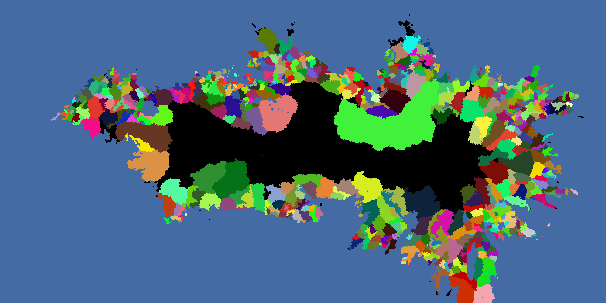 | 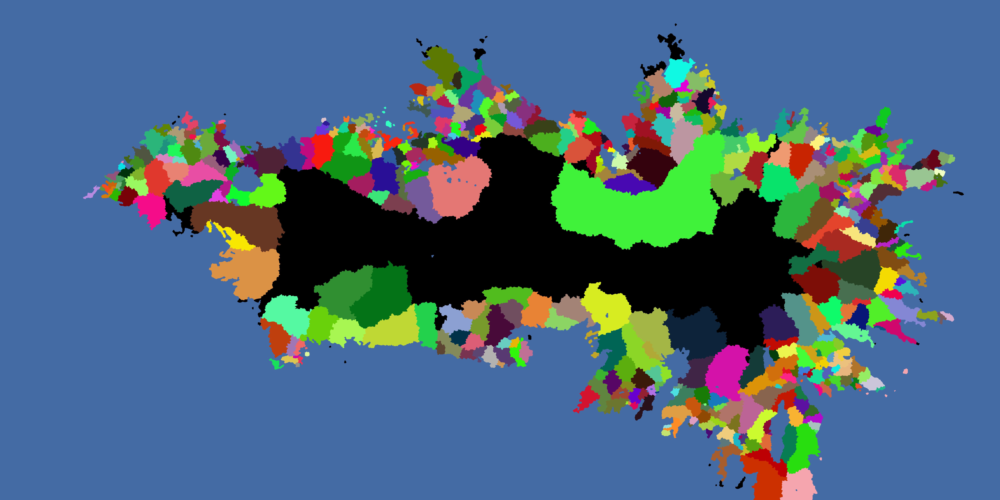 |

| Kingdoms | Empires |
|----------|---------|
| 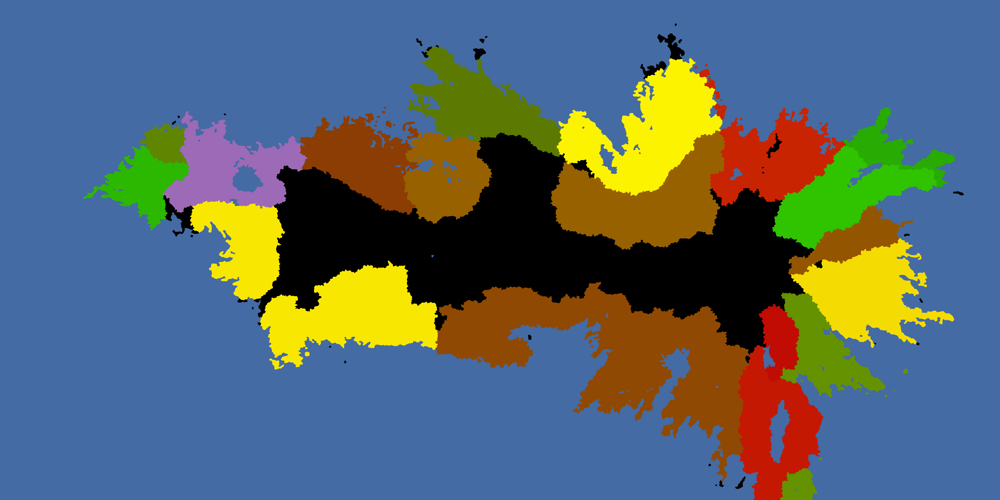 | 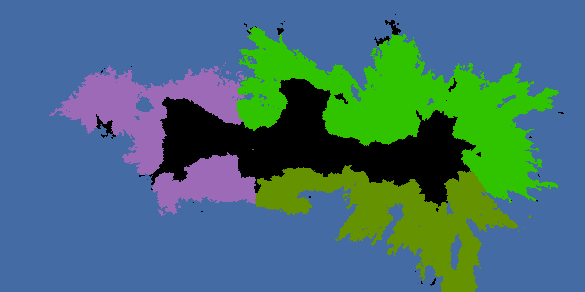 |

Zooming in: barony positions faithfully reflect Azgaar burg placement.

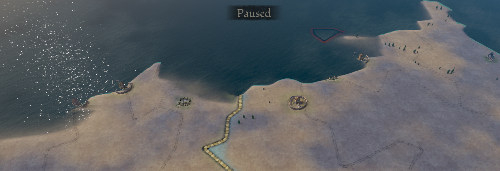

---

## Biome textures

Each Azgaar biome is rendered with a chosen CK3 ground texture, plus steepness-driven hills/mountain overlays and a coastal beach/seafloor blend. All of this lives in one file — `Converter/Lemur/Splats/MaterialRegistry.cs` — and a single line maps one biome to one texture.

| Azgaar biome | CK3 texture |
|---|---|
| Wetland (swamp) | `wetlands_02` |
| Grassland | `plains_01` |
| Savanna | `plains_01_dry` |
| Hot Desert | `desert_01` |
| Cold Desert | `desert_02` |
| Tropical Seasonal Forest | `drylands_01_grassy` |
| Temperate Deciduous Forest | `forest_leaf_01` |
| Tropical Rainforest | `forest_jungle_01` |
| Temperate Rainforest | `forest_pine_01` |
| Taiga | `forestfloor` |
| Tundra | `northern_plains_01` |
| Glacier | `snow` |

Three extra materials run on top of the biome layer:

| Material | When it fires | CK3 texture |
|---|---|---|
| Hills | Mid-steepness slopes (steepness tent 0.20 → 0.40 → 0.75) | `hills_01` |
| Mountain | High-steepness slopes (steepness ramp 0.65 → 1.0) | `central_mountain` |
| Beach | Narrow band at the waterline, asymmetric (3 bytes inland, 30 bytes underwater) | `beach_02` |
| Seafloor | Underwater coastal blend matching the beach band | `mud_wet_01` |

These texture choices are a starting point — see [CONTRIBUTING.md](../CONTRIBUTING.md) for how to propose better ones.

---

## Province terrain (gameplay)

Each barony's CK3 terrain type is picked by scoring it against every candidate terrain and taking the highest score. Two rule shapes contribute:

- **Biome rules** sum the relevant Azgaar biome fractions across the barony's cells. A 60 % Forest / 40 % Jungle barony scores `0.6` for Forest and `0.4` for Jungle. A pure-biome barony scores `1.0`.
- **Steepness rules** (`Hills`, `Mountains`, `DesertMountains`) score on the fraction of cells in a roughness band, and may exceed 1.0 so dominant relief overrules biome cover. Crossovers vs a pure biome: Hills at 67 % hill-grade cells, Mountains/DesertMountains at 50 % mountain-grade cells.

### Azgaar biome → CK3 terrain (default)

| Azgaar biome | CK3 terrain |
|---|---|
| Wetland | `wetlands` |
| Grassland | `plains` |
| Savanna | `drylands` |
| Hot Desert | `desert` (or `desert_mountains` on dominant relief) |
| Cold Desert | `steppe` |
| Tropical Seasonal Forest | `drylands` |
| Temperate Deciduous Forest | `forest` |
| Tropical Rainforest | `jungle` |
| Temperate Rainforest | `forest` |
| Taiga | `taiga` |
| Tundra | `taiga` |
| Glacier | `taiga` (flips to `mountains` on dominant relief) |

### Typical output (Showcase test map, 1094 baronies)

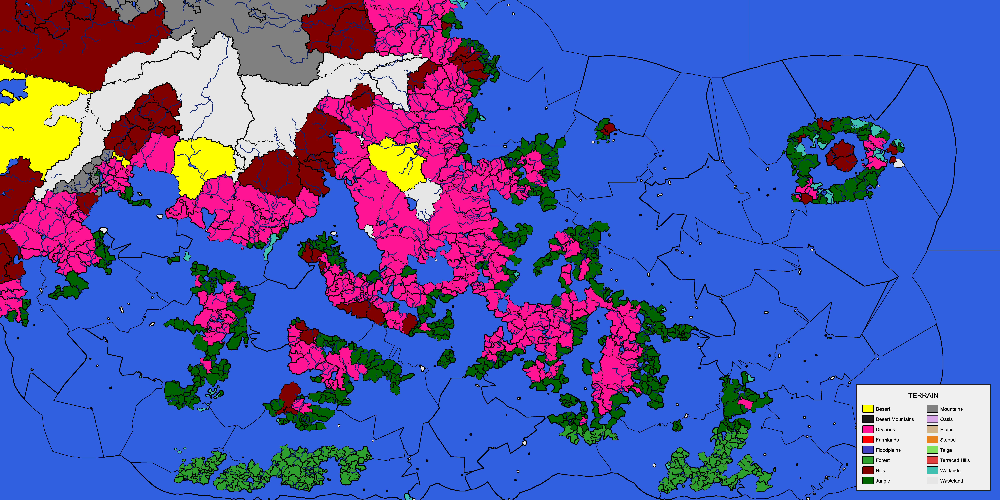

```
jungle               490  ( 44.8%)
drylands             272  ( 24.9%)
forest               234  ( 21.4%)
hills                 50  (  4.6%)
wetlands              25  (  2.3%)
mountains             19  (  1.7%)
desert                 4  (  0.4%)
```

Showcase is a tropical archipelago with cold arid uplands in the north. A temperate continental map would show different proportions (more `forest`, more `plains`, a long `taiga` belt).

---

## County development (start-of-game)

Each county's `change_development_level` at game start is set from its **capital burg's Azgaar population points**, rounded and clamped to `[1, 100]`. One population point maps to one development level.

- **Capital-only**, not summed across the county's baronies. Counties stay in the lower range so the in-game development loop has room to run.
- **County capital**: the Azgaar province capital burg if its cell falls in this county; otherwise the most populous barony.
- Floor `1` avoids CK3's "uninhabited" default for an inhabited county. Ceiling `100` matches the engine cap.

### Typical output (Showcase test map, 796 counties)

```
min     1
max    35
mean    6.6
median  6
p90    12
p99    21
```

Most counties sit in the single digits with a long tail at the top for big-population state capitals. A more urbanised generated map (denser burgs, larger capital populations) shifts the distribution upward without any settings change.

---

## De Jure Consolidation

Small kingdoms and empires are absorbed into larger neighbours to prevent the map fragmenting into dozens of tiny de jure realms.

**Eligibility:** A kingdom with fewer than `MinimumDuchiesPerKingdom` duchies (default: 4) is a merge candidate. An empire with fewer than `MinimumKingdomsPerEmpire` kingdoms (default: 3) is a merge candidate.

**Merge target:** The candidate is absorbed into the neighbour with the most shared cell borders. For kingdoms, a neighbour that shares cultural or religious ancestry is preferred.

**What happens to the title:** The original kingdom or empire title is removed. Its duchies are re-parented into the merge target, becoming de jure part of that larger realm. No ruler is assigned to the merged kingdom — so the dukes of those duchies start the game as independent rulers who happen to be de jure members of a kingdom they don't recognise.

This keeps the map politically fragmented in a way that reflects the Azgaar data, while giving CK3 a coherent de jure structure to build from.

---

## Governments

Each state's Azgaar `form` and `formName` drive the CK3 government type assigned to that state's kingdom and duchies. Kingdoms and duchies resolve independently — the kingdom from its parent state, each duchy from the state its cells belong to — so an absorbed duchy in a foreign kingdom keeps its original state's government (a Republic vassal duchy under a Feudal king works the same way Venice / Genoa do in vanilla CK3 1066).

**Lookup priority:**

1. Exact `formName` match (granular). Most cases land here.
2. Broad `form` fallback (coarse). Used when `formName` is missing or unrecognised.
3. Feudal default. Used when both are missing.

### Granular `formName` → CK3 government

| Output government | Azgaar formNames |
|---|---|
| `feudal_government` | Duchy, Grand Duchy, Principality, Kingdom, Empire, Marches, Dominion, Protectorate, Tsardom, United Kingdom |
| `clan_government` | Beylik, Emirate, Caliphate |
| `tribal_government` | Heptarchy, Free Territory, Council, Community |
| `republic_government` | Republic, Federation, Trade Company, Most Serene Republic, Oligarchy, Tetrarchy, Triumvirate, Diarchy, Junta, Free City, City-state, Union, League, Confederation, United Republic, United Provinces, Commonwealth, Commune |
| `theocracy_government` | Theocracy, Brotherhood, Thearchy, See, Holy State, Divine Duchy, Divine Grand Duchy, Divine Principality, Divine Kingdom, Divine Empire, Diocese, Bishopric, Eparchy, Exarchate, Patriarchate, Imamah |
| `nomad_government` (Khans of the Steppe) | Khanate, Khaganate, Ulus, Horde |
| `administrative_government` (Roads to Power) | Despotate, Satrapy |
| `japan_feudal_government` (All Under Heaven, Sōryō) | Shogunate |

### Broad `form` fallback (when `formName` is unknown)

| Azgaar form | CK3 government |
|---|---|
| Monarchy | `feudal_government` |
| Republic | `republic_government` |
| Union | `republic_government` |
| Theocracy | `theocracy_government` |
| Anarchy | `tribal_government` |

### DLC-gated governments

Nomad, Administrative, and Sōryō (`japan_feudal_government`) all require DLC to be playable as their true type. The converter emits the DLC-specific key directly; the CK3 engine handles missing-DLC fallback automatically at game-start (Nomad → Tribal, Administrative → Feudal, Sōryō → Feudal). No conditional script in the title-history file is needed.

The full table lives in `Converter/Lemur/Governments/GovernmentMap.cs`. To extend it for a new Azgaar formName, add one line to the `FormNameMap` dictionary.

---

## Theme bundles

A **theme bundle** is the converter's internal concept for a coherent cultural aesthetic package. Each culture is assigned one theme bundle, which determines the visual and naming style CK3 uses for that culture's rulers, buildings, armies, and coats of arms.

A bundle groups five CK3 GFX keys and a name list:

| Component | Controls |
|-----------|---------|
| `coa_gfx` | Coat of arms style |
| `building_gfx` | Building appearance on the map |
| `clothing_gfx` | Ruler portrait clothing |
| `unit_gfx` | Army unit appearance |
| Name list | Pool CK3 draws character names from |

Bundles are currently assigned randomly per culture (seeded). The following bundles are available — this list is a snapshot and will expand over time:

| Bundle | Clothing | Units | Names |
|--------|----------|-------|-------|
| `western` | Western European | Western | English |
| `byzantine` | Byzantine | Eastern | Greek |
| `mena` | Middle Eastern / North African | Eastern | Arabic |
| `northern` | Norse / Northern European | Western | Norse |

Future work: bundle selection driven by Azgaar's `nameBase` field so cultures with a Norse namebase automatically receive the `northern` bundle, Arabic → `mena`, etc.

---

## Culture traditions

Each culture gets a handful of traditions. Instead of drawing them at random, the converter weights the pool by two things about the culture: the land it occupies and its ethos.

- **Terrain is a hard filter.** Terrain-flavoured traditions (desert, mountain, forest, jungle, wetland, steppe, maritime, and so on) are only eligible for a culture whose territory actually fits — measured from the same per-barony terrain the converter already assigns (see [Province terrain](#province-terrain-gameplay)), plus a coastal check for seafaring traditions. A landlocked plains culture simply can't roll maritime, mountain, or jungle traditions; a desert culture can't roll forest ones. The wrong flavour is impossible, not merely unlikely.
- **Ethos is a soft nudge.** Among the traditions a culture *is* allowed, those that suit its ethos are favoured and those that clash are made less likely (not forbidden). A warlike culture leans toward martial traditions; a scholarly or devout one leans away from them. This mirrors how the base game treats traditions that fit a culture's ethos versus ones that don't.

Everything else stays in the pool at normal odds, including flavourful regional and heritage traditions — this is a generated fantasy world, so those are allowed to appear anywhere rather than being tied to a real-world region. Because the generic pool is large, a matched terrain tradition shows up *sometimes* rather than every time; the guarantee is that nothing inappropriate to the land ever appears.

Inheritance is unchanged: a child culture copies its parent's traditions and only mutates a slot at a time, and hybrids blend both parents. Only *fresh* picks are filtered this way, so an inherited tradition that no longer matches the land (a forest people descended from desert nomads keeping a desert tradition) is kept on purpose as ancestral flavour.

Selection is fully deterministic — the same seed produces the same traditions. Contributors can find where the pool, the terrain gates, and the ethos weighting live in [CONTRIBUTING.md](../CONTRIBUTING.md#culture-traditions).

---

## Faith tenets

Each faith gets a fixed number of tenets (`TenetCount`, default 3). Instead of drawing them uniformly at random, the converter weights the pool by three things: the faith's type, mutual exclusivity, and the religion's form.

- **Type is a soft nudge.** Each tenet favours a set of faith types (Folk, Organized, Cult, Heresy — taken 1:1 from Azgaar's `Faith.Type`). A tenet on a faith whose type it favours keeps full weight; on any other type it keeps a fraction (`TypeMismatchPenalty`, 0.3) — less likely, not forbidden. So Organized faiths lean toward institutional tenets and Folk faiths toward ancestral ones, without the wrong flavour ever being impossible.
- **Mutual exclusivity is a hard filter.** Tenets that conflict in CK3 (the pacifism/militancy web, the human-sacrifice chain, the syncretism + gnosticism group) can't both land on one faith. A candidate that conflicts with an already-picked tenet is dropped from that faith's draw.
- **Form is a soft nudge.** A faith's Azgaar `form` string maps to a set of themes; a candidate tenet whose themes overlap the faith's form themes is multiplied by `FaithFormThemeBoost` (default 4), and a tenet that doesn't overlap is left at normal odds, never suppressed. The map: Nature Worship / Animism → Nature; Shamanism → Nature + Occult; Totemism → Nature + Ancestral; Ancestor Worship → Ancestral; Philosophical → Scholarly; Ethical → Scholarly + Communal; Cult / Sect → Occult; Dark Cult → Occult + Sacrificial + Hedonistic + Martial. Any other form — including the deity-count labels (Monotheism, Polytheism, …) — maps to no themes and gets no boost.

One tenet is also terrain-gated: `tenet_cthonic_redoubts` needs at least 20% of the faith's land in mountains or desert mountains, measured from the same per-barony terrain the converter already assigns (see [Province terrain](#province-terrain-gameplay)). The six `*_syncretism` tenets target vanilla religions and are inert in a full conversion, so they carry zero weight and never appear.

Inheritance mirrors culture: a child faith copies its parent's tenets and only mutates a slot at a time (`DoctrineMutationRate`, 0.3). A mutated slot can't re-pick its previous tenet, and an inherited tenet that no longer fits is kept on purpose as ancestral flavour. If every candidate for a slot weighs zero, the slot falls back to a uniform pick over the legal, non-conflicting remainder.

Selection is fully deterministic — the same seed produces the same tenets. Contributors can find where the pool, the conflict graph, and the weighting knobs live in [CONTRIBUTING.md](../CONTRIBUTING.md#faith-tenets).

---

## Culture inheritance in practice

Each culture inherits its heritage and language from its Azgaar lineage. Ethos and traditions mutate slot-by-slot as you move down the tree — sibling cultures share the same ancestors but diverge independently.

The Azgaar culture tree for the Showcase map:

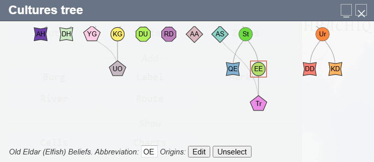

Two sibling cultures in CK3 — same heritage and language (both Elfish), different ethos and traditions:

| Eldar (Elfish) | Quenian (Elfish) |
|----------------|-----------------|
| 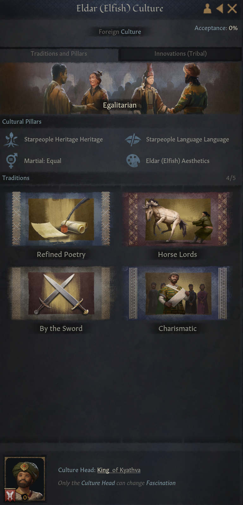 | 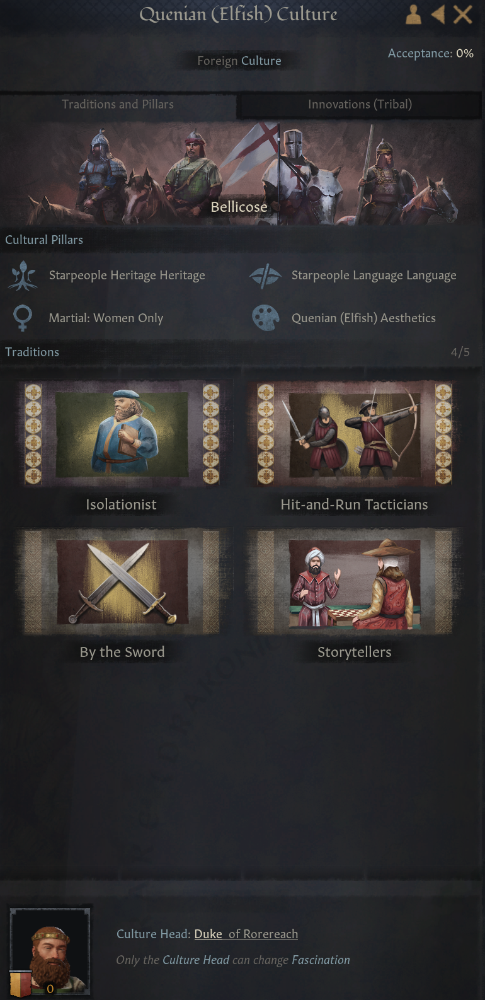 |

---

## Faiths in practice

Each Azgaar religion becomes a faith with its own doctrine set and holy sites. Child faiths inherit from their parent and mutate slot-by-slot.

| Faith doctrines and tenets | Holy sites with modifiers |
|---------------------------|--------------------------|
| 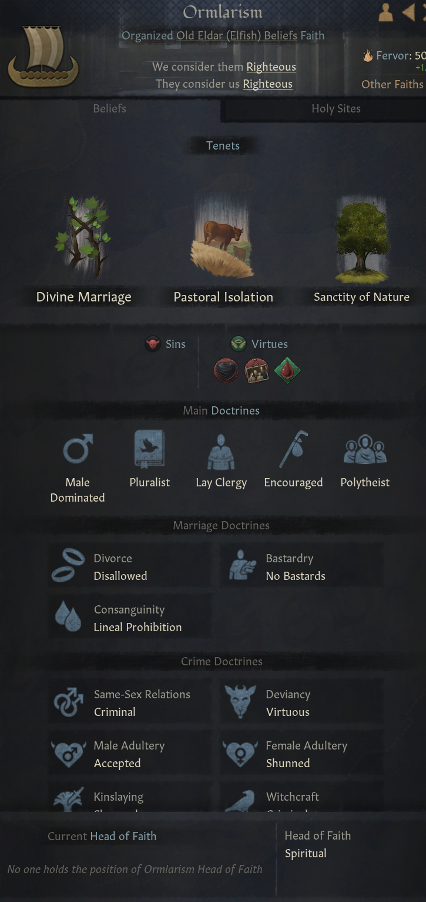 | 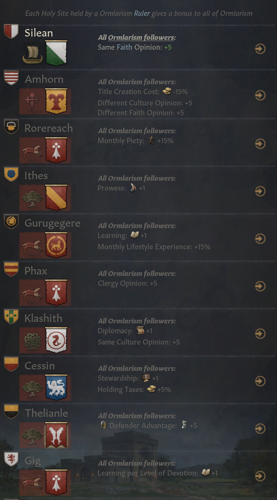 |

**Religious family.** All generated faiths share one CK3 religious family named after your world (e.g. an `Oncynthia` family) — CK3 nests faiths as family → religion → faith. They carry the vanilla Abrahamic hostility doctrine, so different generated faiths regard one another, and any foreign faith, as rivals.

---

## Major Rivers

Rivers with a discharge value at or above `MajorRiverThreshold` are treated as navigable rivers in CK3. They might need a little help to look their best.
Tips:
- Move the river control point closer to one or the other side of the cells they run through.
- Move burgs that are in the middle of rivers to the side of the river.
- Shape province borders along rivers.

**How it works:**

1. Each major river is traced as a ribbon of cells following the Azgaar river path using A\* pathfinding. The ribbon width (in cells) is set by `RiverProvinceCellCount`.
2. The ribbon cells are carved out of any land cells they overlap, splitting land cells along the river edge.
3. The carved ribbon becomes a river province.
4. Very small fragments produced by carving (less than 30% the size of the main piece) are absorbed into their geometrically closest land neighbor to prevent orphaned slivers.

---

## Fine-tuning your Azgaar map

The converter works from any default Azgaar map. These areas benefit from deliberate choices in Azgaar. None are required.

**Provinces without burgs become wasteland.**
A province with no burgs generates no county and no playable territory. Add at least one burg if you want a region inhabited.

**Province size and burg count affect county quality.**
The converter works best with 4–12 burgs per province, which produces roughly 2–3 counties of about 4 baronies each. Provinces with only 1–2 burgs result in very thin duchies. Clean up province borders where Azgaar has produced oddly shaped or near-empty provinces.

**More burgs = richer duchy.**
A province with 10 burgs becomes a duchy with 10 baronies. A province with 1 burg becomes a duchy with 1 barony.

**Culture and religion distribution is cell-weighted.**
Each barony's starting culture and religion are determined by a vote across the cells that make up that barony. A barony on a cultural border reflects whichever culture holds more cells. Adjusting cultural borders in Azgaar directly adjusts the CK3 output.

**Major rivers work best along duchy borders.**
A major river that runs between two Azgaar provinces produces clean barony borders on both sides. A river that cuts through the middle of a single province will divide that province's baronies but cannot prevent them from being assigned across the river — the converter does its best to reassign cross-river cells, but the result is cleaner when rivers follow your political boundaries.

**Check discharge values before setting the threshold.**
In Azgaar, hover over a river to see its discharge. Major rivers typically read in the hundreds to thousands; minor rivers are in the single or low double digits. Set `MajorRiverThreshold` just below the discharge of the rivers you want to be navigable. A threshold of 1000 is a reasonable starting point for most maps.

**Fewer major rivers = faster conversion and cleaner maps.**
Each major river requires cell carving and geometry operations. 2–5 major rivers per map is a good sweet spot. If conversion is slow or province geometry looks fragmented near rivers, try raising the threshold to reduce the number of rivers processed.
